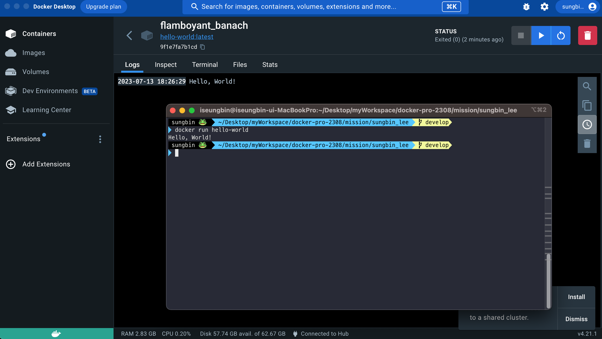

# 사전 미션

## 1. 컨테이너 기술이란 무엇입니까? 
컨테이너 기술은 애플리케이션이 독립적으로 실행되는 격리된 환경을 제공하여 이식성을 높이는 가상화 방법입니다. 컨테이너는 애플리케이션 코드와 관련된 구성 파일, 라이브러리, 종속성 등을 함께 번들링하여 단일 실행 가능한 소프트웨어 패키지로 캡슐화합니다. 이러한 컨테이너화된 애플리케이션은 운영 체제의 사본으로 번들링되지 않으며 독립적으로 실행됩니다. 대신, 호스트 운영 체제에 설치된 오픈 소스 런타임 엔진(예: Docker 런타임 엔진)을 통해 컨테이너가 동일한 컴퓨팅 시스템 내의 다른 컨테이너와 운영 체제를 공유하는 통로 역할을 수행합니다. 이를 통해 애플리케이션은 독립적으로 실행되며 다른 환경에 영향을 받지 않고 일관성 있게 작동할 수 있습니다. 
## 2. 도커란 무엇입니까?
Docker는 컨테이너 기술을 사용하여 애플리케이션의 배포와 관리를 자동화할 수 있는 오픈 소스 플랫폼입니다. Docker는 사용하기 쉬운 인터페이스와 도구를 제공하여 컨테이너를 생성, 배포, 관리하는 과정을 간소화합니다. Docker는 애플리케이션을 이식 가능한 컨테이너로 패키징하는 과정을 단순화하여 다양한 환경에서 소프트웨어를 빌드, 배포 및 실행하기 쉽게 만들어줍니다.

## 3. 도커 파일, 도커 이미지, 도커 컨테이너의 개념은 무엇이고, 서로 어떤 관계입니까?
* 도커 파일(Dockerfile):Docker 이미지를 빌드하기 위한 명령어가 포함된 텍스트 파일입니다. 도커 파일은 애플리케이션의 환경과 종속성을 정의하며, 도커 이미지를 빌드하는 데 사용됩니다.
* 도커 이미지(Docker image):  도커 파일을 사용하여 빌드된 실행 가능한 패키지입니다. 이미지는 애플리케이션 실행에 필요한 모든 구성 요소와 종속성을 포함합니다. (추가적인 설치등이 필요 없게 하나의 포장으로 엮어놓은 패키징된 파일)
* 도커 컨테이너(Docker container): 도커 이미지의 인스턴스입니다.(이미지를 실행한 상태) 도커 컨테이너는 패키징된 도커 이미지를 독립적으로 실행되는 가상 환경(격리된 공간)에서 동작시키는 것 입니다.

도커 파일을 작성하여 도커 이미지를 빌드한 후, 이 이미지를 사용하여 도커 컨테이너를 생성하고 실행합니다.

## 4. [실전 미션] 도커 설치하기 

