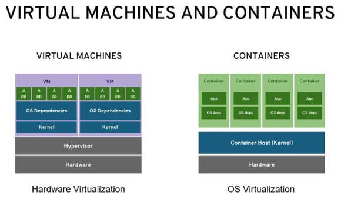
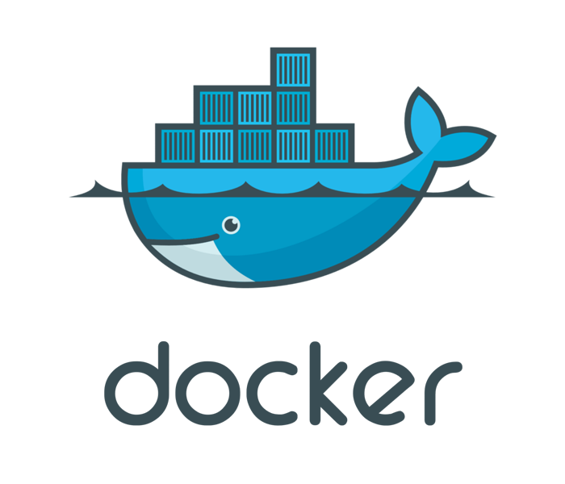
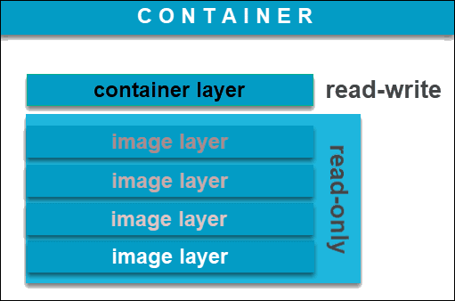
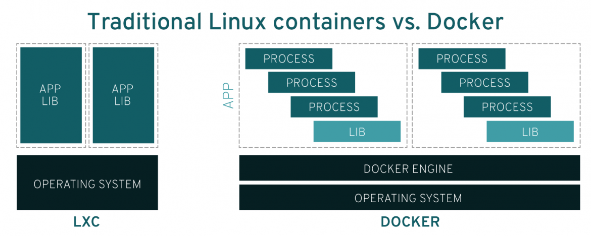
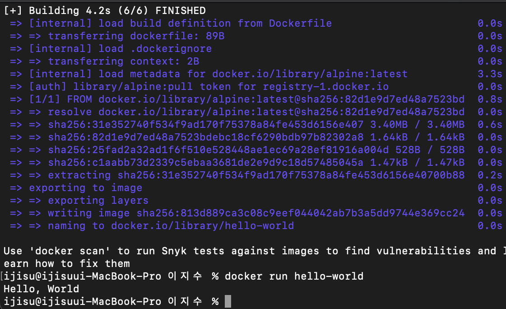

## 1.컨테이너 기술이란?

-------------------------

* 항구의 화물선과 같이 OS 커널단에서 어플리케이션을 독자적인 프로세스로 독립시키는 기술.
* 프로세스를 독립시키는 namespace 와 하드웨어 자원을 분배하는 control group 을 사용한다.
* 기존 virtual machines 모델들과 다른점은 따로 os 의 재설치가 필요없다는것.
* 기존 온프로미스 방식보단 클라우드 같이 대용량 컴퓨터를 사용할경우 효율은 극대화된다.
<br>
<br>
<br>


## 2.도커란?

----------------------------

* 컨테이너 기술을 기반으로한 오픈소스 가상화 플랫폼
* 환경에 구애받지 않고 애플리케이션을 신속하게 배포 및 확장할 수 있는 장점이 있다.
* [해당 세션](https://www.youtube.com/watch?v=wW9CAH9nSLs) 을 통하여 처음 공개 되었다.
<br>
<br> 
<br>


## 3.도커 파일, 도커 이미지, 도커 컨테이너 개념과 관계

----------------------------------

* 도커 파일
  * 컨테이너에 설치해야하는 패키지, 소스코드, 명령어, 환경변수설정 등을 기록한 파일
  * 도커 파일을 빌드하면 자동으로 도커 이미지가 생성된다.
  * 주요 문법
  
    | 구문 | 설명                                   |
    |---|--------------------------------------|
    | # | 코멘트                                  | 
    | FROM  | 베이스 이미지(Base Image) 지정               | 
    | MAINTAINER  | 명령 및 컨테이너 실행시 적용할 유저설정 ( 기본: root ) | 
    | RUN  | 컨테이너 빌드를 위한 실행 Commands              | 
    | COPY  | 컨테이너 빌드시 호스트 파일을 복사                  | 
    | ADD  | 컨테이너 빌드시 호스트의 (tar,url)을 복사          | 
    | ENV  | 환경 변수                                | 
    | USER  | 명령 및 컨테이너 실행시 적용할 유저설정 ( 기본: root )  |

<br>
<br>
<br>

* 도커 이미지
  * 도커 위에서 어플리케이션을 실행하는데 필요한 파일과 구성요를 포함한 소프트웨어 패키지
  * 읽기전용 으로 스냅샷 기능을 포함한다.
  * 이미지는 템플릿일뿐 도커 컨테이너 위에서 실행된다.

<br>



<br>
<br>

* 도커 컨테이너 
  * 도커의 이미지를 실행한 상태 및 인스턴스
  * 리눅스 컨테이너와는 다르게 각 도커 컨테이너별 이미지 레이어로 버전관리를 용이하게 해준다
  * 도커 컨테이너는 하나의 컨테이너에 하나의 어플리케이션을 사용하길 권장한다.

<br>



<br>

```
* 관계

도커파일 빌드 -> 도커 이미지 생성 -> 도커 컨테이너에서 도커 이미지 실행
```

-------------------------------------------

## 4.도커 설치하기

<br>




    
    