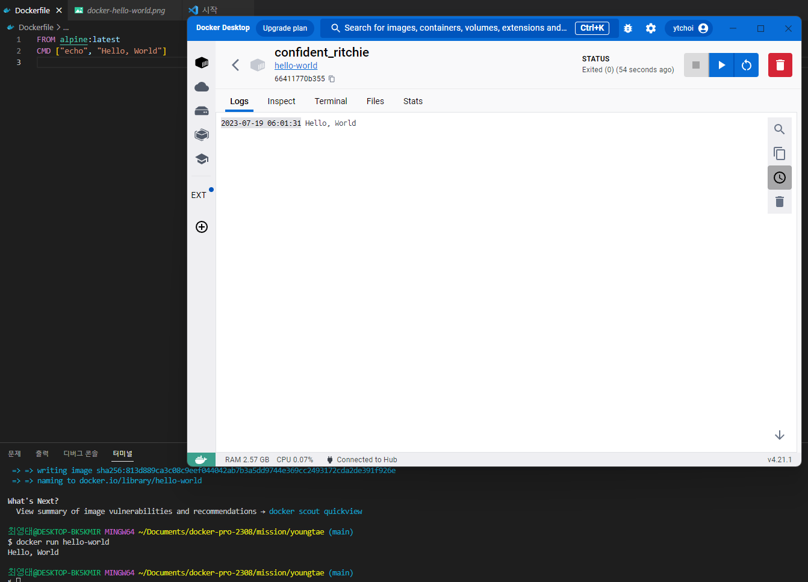

# 사전 미션
 

## 1. 컨테이너 기술이란 무엇입니까? (100자 이내로 요약)
>컨테이너 기술이란 애플리케이션과 그 환경을 한데 묶어, 서로 다른 컴퓨팅 환경에서도  동일하게 작동하게 하는 기술입니다. 이를 통해 소프트웨어의 이식성이 높아집니다.

 

## 2. 도커란 무엇입니까? (100자 이내로 요약)
>도커는 컨테이너 기술을 쉽게 사용할 수 있게 도와주는 오픈 소스 플랫폼입니다.  애플리케이션과 의존성을 함께 패키징해 일관된 환경에서 실행할 수 있게 합니다.

 

## 3. 도커 파일, 도커 이미지, 도커 컨테이너의 개념은 무엇이고, 서로 어떤 관계입니까?
>- **도커 파일** : 도커 이미지를 생성하기 위한 설정 파일로,  애플리케이션 실행에 필요한 환경 설정과 의존성 등을 정의합니다. 
>- **도커 이미지** : 도커 파일에 따라 생성된 실행 가능한 소프트웨어 패키지로,  애플리케이션 코드, 라이브러리, 환경 변수, 설정 파일 등을 포함합니다. 
>- **도커 컨테이너** : 도커 이미지를 기반으로 실행된 인스턴스로, 도커 이미지의 실행 환경입니다.  
>도커 파일은 설정을 통해 도커 이미지를 만들고, 이 이미지는 도커 컨테이너를 실행하는데 사용됩니다. 이 과정을 통해 애플리케이션의 구축부터 배포까지 일관된 환경을 제공합니다.

 

## 4. [실전 미션] 도커 설치하기
