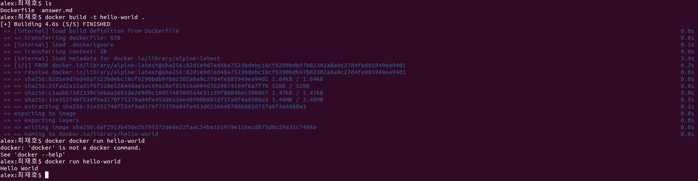

## 1. 컨테이너 기술이란 무엇입니까? (100자 이내로 요약)

컨테이너 기술은 애플리케이션과 모든 종속성을 격리된 환경에 패키징하는 가벼운 가상화 기술로, 이식성과 확장성을 향상시켜 애플리케이션을 더 쉽게 배포하고 실행할 수 있게 해줍니다.

## 2. 도커란 무엇입니까? (100자 이내로 요약)

도커는 컨테이너 기술을 이용하여 애플리케이션을 개발, 배포, 실행하는 오픈 소스 플랫폼입니다. 도커를 사용하면 애플리케이션과 그 종속성을 격리된 환경인 컨테이너로 패키징하여 이식성과 확장성을 향상시킬 수 있습니다. 이러한 컨테이너는 다양한 환경에서 일관되게 동작하므로 애플리케이션 배포와 관리가 더욱 편리해집니다.

## 3. 도커 파일, 도커 이미지, 도커 컨테이너의 개념은 무엇이고, 서로 어떤 관계입니까?

### Dockerfile

- 도커 이미지를 생성하기 위한 텍스트 파일로, 컨테이너 안에서 실행될 애플리케이션과 종속성, 설정 등을 정의합니다.

### Docker image

- 도커 파일을 기반으로 만들어지며, 컨테이너를 실행하는데 필요한 모든 파일과 설정이 포함된 가상 파일 시스템입니다.

### Docker container

- 도커 이미지를 기반으로 생성되며, 격리된 환경에서 애플리케이션을 실행하는 인스턴스입니다.

### 관계

- 도커 파일은 도커 이미지를 빌드하는데 사용됩니다. 도커 이미지는 컨테이너를 실행하는데 필요한 모든 것을 포함하고 있으며, 도커 컨테이너는 이러한 도커 이미지를 기반으로 생성되어 실행됩니다. 즉, 도커 파일은 도커 이미지의 빌드 지침을 제공하고, 도커 이미지는 도커 컨테이너를 생성하고 실행하는데 사용됩니다.

## 4. [실전 미션] 도커 설치하기 (참조: 도커 공식 설치 페이지)

