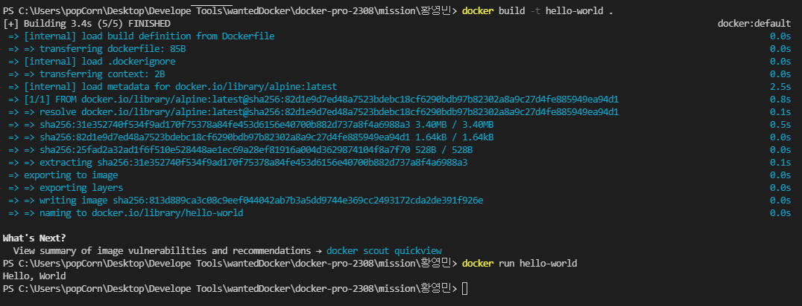

# 사전미션

## 1. 컨테이너 기술이란 무엇입니까?
컨테이너 기술은 애플리케이션을 격리된 환경에서 실행할수 수 있도록 하는 가상화 기술의 한 형태로,
호스트 운영체제의 리소스를 공유하면서 독립적인 실행 환경을 제공합니다.
이는 애플리케이션을 다양한 환경에서 일관되게 실행할 수 있게 해주고, 배포,관리를 단순화하여, 확장성과 이식성을 향상시켜줍니다.

## 2. 도커란 무엇입니까?
가상 머신처럼 독립된 실행환경을 만들어주는 것으로, 운영체제를 설치하 것과 유사한 효과를 낼 수 있지만, 
실제 운영체제를 설치하지 않기 때문에 설치 용량이 적고 실행 속도 또한 빠릅니다.

## 3. 도커 파일, 도커 이미지, 도커 컨테이너의 개념은 무엇이고, 서로 어떤 관계입니까?
* 도커 파일(Dockerfile): 도커파일은 도커이미지를 빌드하기 위한 텍스트파일로 도커이미지 생성에 필요한 모든 단계와 명령어를 정의합니다.
* 도커 이미지(Docker image): 도커컨테이너를 생성하는데 사용되는 응용프로그램과 그에 필요한 종속성을 포함하는 실행가능한 파일시스템입니다.
* 도커 컨테이너(Docker container): 도커이미지를 기반으로 생성되는 실행가능한 인스턴스로,격리된 환경에서 애플리케이션이 실행되도록 도커 플랫폼에서 관리됩니다.

도커 파일로 도커이미지를 빌드하고
도커 이미지로 도컨 컨테이너를 생성하고
도커 컨테이너를 실행하여 애플리케이션을 
도커 환경에서 사용하게 됩니다.

## 4. [실전 미션] 도커 설치하기
